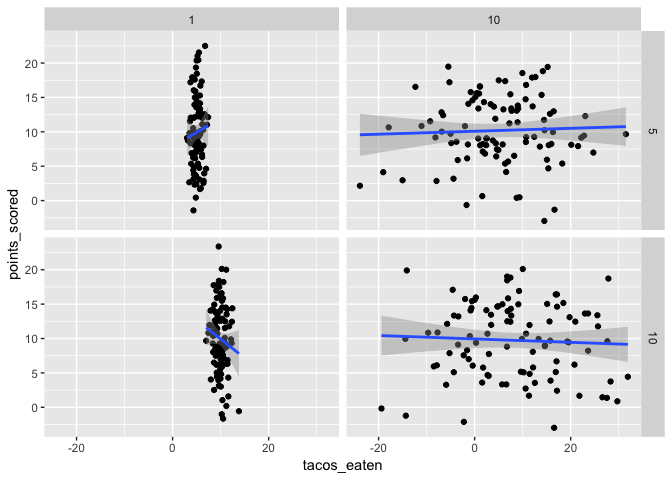

easy\_sim
================

  - [Part 1: Write a function](#part-1-write-a-function)
  - [Part 2: Simulate data](#part-2-simulate-data)

Get
    started

``` r
library(tidyverse)
```

    ## ── Attaching packages ───────────────────────────────────────────────── tidyverse 1.2.1 ──

    ## ✔ ggplot2 3.1.0       ✔ purrr   0.3.0  
    ## ✔ tibble  2.0.1       ✔ dplyr   0.8.0.1
    ## ✔ tidyr   0.8.2       ✔ stringr 1.4.0  
    ## ✔ readr   1.3.1       ✔ forcats 0.4.0

    ## ── Conflicts ──────────────────────────────────────────────────── tidyverse_conflicts() ──
    ## ✖ dplyr::filter() masks stats::filter()
    ## ✖ dplyr::lag()    masks stats::lag()

``` r
set.seed(1)
```

# Part 1: Write a function

First write a function that simulates our
data

``` r
sim_tacos_and_points <- function(n_rows, mean_tacos, sd_tacos, sd_points, mean_points, ...){
   tibble(
      tacos_eaten = rnorm(n_rows, mean_tacos, sd_tacos),
      points_scored = rnorm(n_rows, mean_points, sd_points)
   )
}
```

Example using the function

``` r
sim_tacos_and_points(
   n_rows = 10,
   mean_tacos = 5,
   sd_tacos = 3,
   mean_points = 10,
   sd_points = 3
)
```

    ## # A tibble: 10 x 2
    ##    tacos_eaten points_scored
    ##          <dbl>         <dbl>
    ##  1        3.12         14.5 
    ##  2        5.55         11.2 
    ##  3        2.49          8.14
    ##  4        9.79          3.36
    ##  5        5.99         13.4 
    ##  6        2.54          9.87
    ##  7        6.46          9.95
    ##  8        7.21         12.8 
    ##  9        6.73         12.5 
    ## 10        4.08         11.8

# Part 2: Simulate data

Make a data frame of all parameter combinations we’re interested in

``` r
parameters <- 
   crossing(
      n_rows = 100,
      mean_tacos = c(5, 10),
      sd_tacos = c(1, 10),
      mean_points = c(10),
      sd_points = c(5)
   ) %>% print()
```

    ## # A tibble: 4 x 5
    ##   n_rows mean_tacos sd_tacos mean_points sd_points
    ##    <dbl>      <dbl>    <dbl>       <dbl>     <dbl>
    ## 1    100          5        1          10         5
    ## 2    100          5       10          10         5
    ## 3    100         10        1          10         5
    ## 4    100         10       10          10         5

Row-wise simulate data and store in a column of dataframes.

``` r
parameters <- 
   parameters %>% 
   mutate(data = pmap(., sim_tacos_and_points)) %>% 
   print()
```

    ## # A tibble: 4 x 6
    ##   n_rows mean_tacos sd_tacos mean_points sd_points data              
    ##    <dbl>      <dbl>    <dbl>       <dbl>     <dbl> <list>            
    ## 1    100          5        1          10         5 <tibble [100 × 2]>
    ## 2    100          5       10          10         5 <tibble [100 × 2]>
    ## 3    100         10        1          10         5 <tibble [100 × 2]>
    ## 4    100         10       10          10         5 <tibble [100 × 2]>

Examples of a few things we can do with this

0)  Extract just one of the datasets

<!-- end list -->

``` r
# based on row number
parameters$data[[1]]
```

    ## # A tibble: 100 x 2
    ##    tacos_eaten points_scored
    ##          <dbl>         <dbl>
    ##  1        5.92          7.47
    ##  2        5.78         16.7 
    ##  3        5.07          8.93
    ##  4        3.01          9.10
    ##  5        5.62          9.50
    ##  6        4.94         13.6 
    ##  7        4.84          9.63
    ##  8        3.53          9.81
    ##  9        4.52          6.59
    ## 10        5.42          8.38
    ## # … with 90 more rows

``` r
# based on parameters
parameters %>% 
   filter(mean_tacos == 5, sd_tacos == 1) %>% 
   pull(data) %>% 
   .[[1]]
```

    ## # A tibble: 100 x 2
    ##    tacos_eaten points_scored
    ##          <dbl>         <dbl>
    ##  1        5.92          7.47
    ##  2        5.78         16.7 
    ##  3        5.07          8.93
    ##  4        3.01          9.10
    ##  5        5.62          9.50
    ##  6        4.94         13.6 
    ##  7        4.84          9.63
    ##  8        3.53          9.81
    ##  9        4.52          6.59
    ## 10        5.42          8.38
    ## # … with 90 more rows

1)  Unnest all datasets and plot

<!-- end list -->

``` r
parameters %>% 
   unnest() %>% 
   ggplot(aes(x = tacos_eaten, y = points_scored)) +
   geom_point() +
   facet_grid(mean_tacos ~ sd_tacos) +
   geom_smooth(method = "lm")
```

<!-- -->

2)  Fit a model to each dataset and store that in another column

<!-- end list -->

``` r
parameters <- 
   parameters %>% 
   mutate(
      model = data %>% map(~ lm(points_scored ~ tacos_eaten, data = .)),
      coef = model %>% map(broom::tidy)
   ) %>% 
   print()
```

    ## # A tibble: 4 x 8
    ##   n_rows mean_tacos sd_tacos mean_points sd_points data      model  coef   
    ##    <dbl>      <dbl>    <dbl>       <dbl>     <dbl> <list>    <list> <list> 
    ## 1    100          5        1          10         5 <tibble … <S3: … <tibbl…
    ## 2    100          5       10          10         5 <tibble … <S3: … <tibbl…
    ## 3    100         10        1          10         5 <tibble … <S3: … <tibbl…
    ## 4    100         10       10          10         5 <tibble … <S3: … <tibbl…

Look at coefficients for each model

``` r
parameters$coef
```

    ## [[1]]
    ## # A tibble: 2 x 5
    ##   term        estimate std.error statistic p.value
    ##   <chr>          <dbl>     <dbl>     <dbl>   <dbl>
    ## 1 (Intercept)    7.92      3.03      2.61   0.0104
    ## 2 tacos_eaten    0.400     0.587     0.681  0.497 
    ## 
    ## [[2]]
    ## # A tibble: 2 x 5
    ##   term        estimate std.error statistic  p.value
    ##   <chr>          <dbl>     <dbl>     <dbl>    <dbl>
    ## 1 (Intercept)  10.1       0.562     17.9   1.05e-32
    ## 2 tacos_eaten   0.0215    0.0504     0.426 6.71e- 1
    ## 
    ## [[3]]
    ## # A tibble: 2 x 5
    ##   term        estimate std.error statistic  p.value
    ##   <chr>          <dbl>     <dbl>     <dbl>    <dbl>
    ## 1 (Intercept)   15.4       4.19       3.69 0.000373
    ## 2 tacos_eaten   -0.551     0.420     -1.31 0.193   
    ## 
    ## [[4]]
    ## # A tibble: 2 x 5
    ##   term        estimate std.error statistic  p.value
    ##   <chr>          <dbl>     <dbl>     <dbl>    <dbl>
    ## 1 (Intercept)   9.94      0.675     14.7   1.37e-26
    ## 2 tacos_eaten  -0.0248    0.0491    -0.506 6.14e- 1
